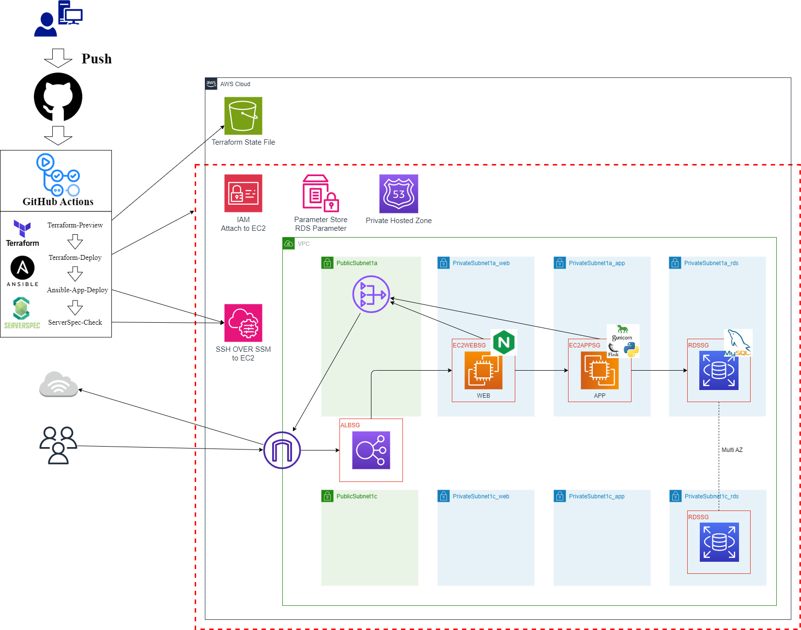
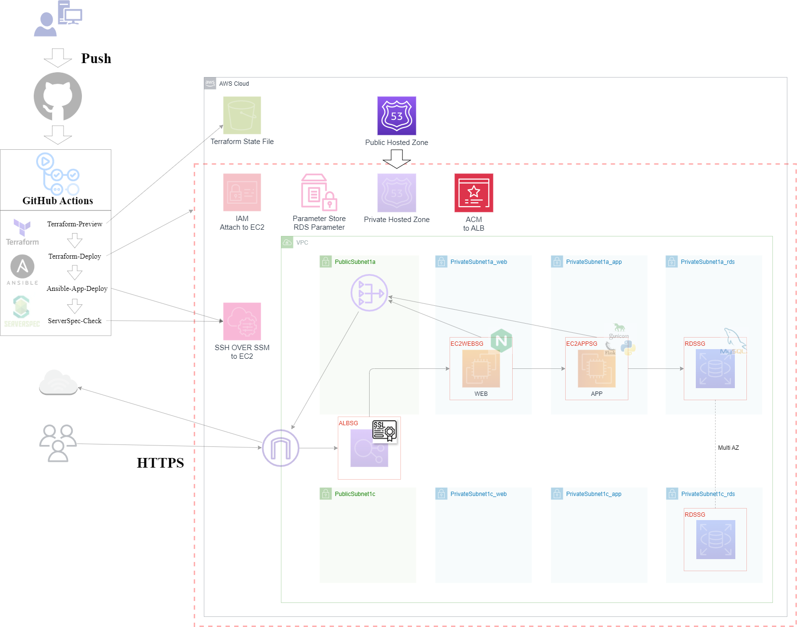

# Flask_App_CICD_AWS

## 概要

このリポジトリは、自作Flaskアプリケーション（[flask-app](https://github.com/tomi050403/flask-app)）を対象に、
**GitHub Actions** を用いて **CI/CDパイプライン** にて**Terraform / Ansible / Serverspec によってAWS環境への自動構築・構成検証**を実施するためのリポジトリです。

---

## ワークフロー

| ジョブ | 処理概要 | ステップ概要（要点）|
| ------ | -------- | --------------------- |
| **Terraform-Preview**  | ・構文チェック  ・変更差分検証 | terraform `init` / `validate`  　→構文チェック  terraform `plan -detailed-exitcode` 　→ Plan の終了コード（差分有無）を保存 |
| **Terraform-Deploy**   | ジョブの実行条件：更新差分が**有り**の場合 ・インフラデプロイ  ・リソース数カウント|terrform `apply -auto-approve` 　→コミットメッセージに `[apply]` がある場合デプロイ   terraform `state list`  　→リソース数をカウントし、保存|
| **Ansible-App-Deploy** | ジョブの実行条件：リソース数が規定の数ある場合 ・各種設定ファイルの更新（情報取得） ・EC2へのアプリデプロイ | AWSリソース必要情報を取得 　→各種vars,j2ファイルを更新  ansible-playbook `setup.yml` 実行 |
| **ServerSpec-Check**   | ジョブの実行条件：前ジョブの完了 ・各種設定ファイルの更新（情報取得） ・構成テスト | AWSリソース必要情報を取得 　→helper.rb,テストコードを更新 Ruby/Bundler セットアップ `bundle exec rake spec` 実行|

---

## 構成図
.github/workflows/cicd.ymlにてTF_VAR_environmentの値（dev or prod）を変更することで構成内容を変化。

## Development
**TF_VAR_environment**を**dev**としてワークフローにpushした時の構成。 
- terraformのリソース構築範囲は赤破線部分となります。
   
## Production
**TF_VAR_environment**を**prod**としてワークフローにpushした時の構成。
- terraformのリソース構築範囲は赤破線部分となります。
- Developmentとの差分として、同様の構成について独自ドメインにてHTTPS化するにあたり関連する部分が追加されております。 
   
